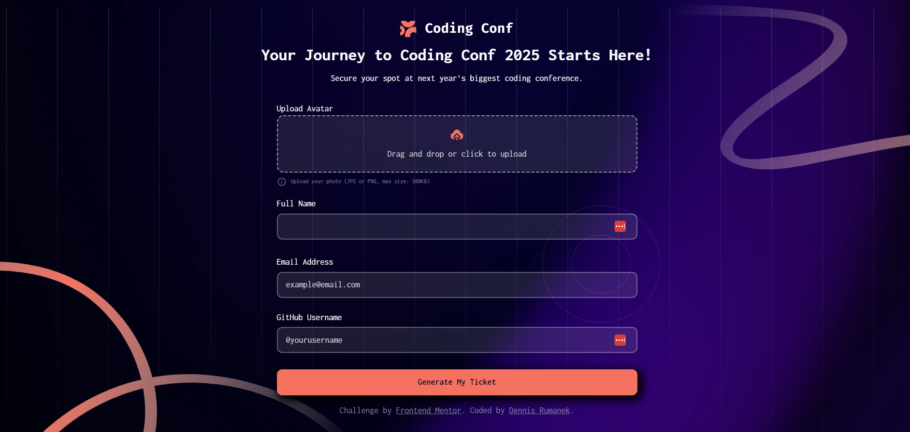

# 🎟️ Conference Ticket Generator

> An interactive, responsive web app that generates a personalised conference ticket with live validation, image upload, and dynamic UI updates.
> 

---

## 👀 Why This Project Stands Out

- Drag & drop avatar upload with live preview  
- Strong client-side form validation (name, email, GitHub username)  
- Dynamic ticket generation with a unique ticket number  
- Avatar persistence using `localStorage`  
- Fully responsive, mobile-first design  
- Advanced CSS styling with custom properties & layered visuals  

---

## 🧠 What I Learned

- Implementing **drag-and-drop file uploads**
- Using the **FileReader API** for live image previews
- Writing **robust regex-based form validation**
- Managing UI state without frameworks
- Structuring scalable, maintainable CSS
- Creating smooth UX transitions using class toggling
- Persisting user data with **localStorage**

> 📌 This project was built as part of a **Frontend Mentor challenge**, helping me strengthen real-world frontend problem-solving skills and attention to UI/UX details.

---

## 🛠️ Tech Stack

- **HTML5** – Semantic structure & accessibility  
- **CSS3** – Modular CSS, custom properties, responsive layouts  
- **Normalize.css** – Cross-browser consistency  
- **JavaScript (Vanilla)** – DOM manipulation, validation, state handling  
- **FileReader API** – Image upload & preview  
- **LocalStorage API** – Persisting user avatar  

---

## ✨ Features

- Drag & drop or click-to-upload avatar image  
- Image size validation (max 500KB)  
- Email validation with inline error feedback  
- GitHub username validation using regex  
- Change/remove uploaded avatar  
- Auto-generated unique ticket number  
- Seamless UI transition from form → ticket  
- Gradient text & layered background effects  

---

## ⚙️ How to Run Locally

1. Clone the repository  
   ```bash
   git clone https://github.com/your-username/conference-ticket-generator.git
   
2. Open index.html in your browser
3. Upload an avatar, fill in details, and generate your ticket 🎉
